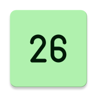

# Calender-Icon

An icon for the calendar app that changes based on the day of the month written in Kotlin.

## What Problem Does It Solve?
This app solves the problem that many android devices have which is the calendar icon is nice and follows the date but only for the preinstalled app. This means the google calendar on pixels and the Samsung calendar on samsung phones.
Some users (like myself) use another calendar with less permissions, no internet access, and that are open source like etar. These apps are nice but you lose the ability to see the date when looking at the icon.
While you could setup some macro to redirect the stock calendar app to your other one, this could prove battery intensive, requires extra storage, and may not work every time. It also doesn't prevent data collection by that app like uninstalling it does.

## Features:
* FOSS licensed under the GPLv3
* Just over 100kb in size
* No impact on battery life
* Simple design and Material You icon
* No tracking
* Works on any android device 1.0+
* Absolutely no ads or unnecessary features

## How It Works
The theory of operation is simple. It has 31 activities for all 31 days in a month.
When the app is run it will always set the icon, then cancel any existing alarms and set a new one. This alarm goes off at midnight to ensure that the app changes soon after midnight.
The last thing is it runs at boot and sets the icon then sets an alarm.

## Tested
* Android 13
* Android 11
* Android 7.1.2 *
* Android 2.3.3 *

\* Does not persist on the homescreen after date change

## Credits
The font used for the icons is *[F1.8](https://dotcolon.net/font/f1_8/)* by Sora Sagano licensed under the *[SIL Open Font License, Ver 1.1](OFL.txt)*
